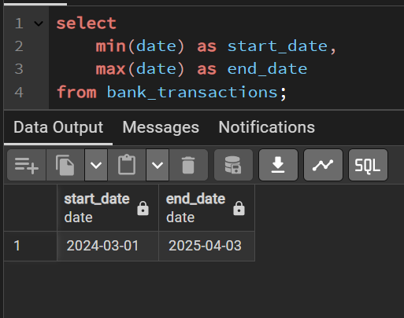
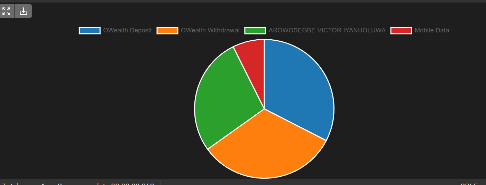

# 🏦 Bank Statement Parser Project
The Bank Statement Parser is an automated tool designed to extract, clean, and categorize financial data from bank statements in various formats (PDF, CSV, XLSX). The parser uses OCR (Optical Character Recognition) and text processing techniques to accurately identify transaction details such as date, description, amount, and balance. It currently supports one bank statement template (Opay - A fintech in Nigeria) and applies rule-based classification to tag transactions (e.g., groceries, utilities, salary, etc.).


## 🚀 Features

- 📄 **Multi-format Support** – Import statements in PDF, CSV, or XLSX formats  
- 🧠 **PDF Parsing** – Extract data from scanned PDFs using Tesseract OCR or PDF parsing tools like pymupdf etc. 
- 🧹 **Data Cleaning & Normalization** – Standardize transaction details (date, amount, description, balance)  
- 🏷️ **Transaction Categorization** – Classify expenses into categories (e.g., groceries, rent, utilities)  
- 🔍 **Duplicate Detection** – Prevent duplicate transactions during bulk imports  
- 📤 **Export Options** – Output parsed data to JSON, CSV, or a database  


## Project Structure
```
BANK_STATEMENT_PARSER/
├── .venv/                     # Virtual environment (not included in repo)
├── bank_parser/              # Core parsing and utilities
│   └── utils.py              # Utility functions
│       ├── logger.py             # Logging setup
│   ├── db_loader.py          # DB loader module
│   ├── model.py              # Data models
│   ├── wrangler.py           # Data wrangling logic
│   └── opay_bs/              # Opay-specific logic
│       ├── data/             # Sample or raw data for Opay parsing
│       ├── __init__.py       
│       ├── opay_bankstatement.pdf # Example bank statement
│       └── opay_bs_parser.ipynb  # Jupyter notebook for Opay parser
├── tests/                    # Unit and integration tests
│   └── __init__.py
├── main.py                   # Entry point for CLI
├── .gitignore                # Git ignore rules
├── poetry.lock               # Dependency lock file
├── pyproject.toml            # Project metadata and dependencies
└── README.md                 # Project documentation
```

## 📸 Sample Input

| Date       | Description        | Amount   | Balance   |
|------------|--------------------|----------|-----------|
| 2025-06-01 | Tesco Supermarket  | -45.80   | 1,954.20  |
| 2025-06-03 | Salary Credit      | +2,000.00| 3,954.20  |

## 🛠️ Tech Stack

- **Python** – Core logic and parsing
- **Pandas** – Data manipulation
- **PyPDF2 / pdfplumber** – PDF parsing
- **Regex** – Pattern-based data extraction
- **PostgreSQL** – Data storage

## 📁 Results
#### Duration


#### Top 4 Transactions


## 📦 Installation

```bash
git clone https://github.com/Iyanuvicky22/bank_statement_parser.git
cd bank-statement-parser
```

## ⚙️ Usage

### CLI Mode

```bash
python parser.py --file path/to/statement.pdf
```

## 📁 Output

- Parsed transactions saved as JSON, CSV, and loaded to a connected database.
- Optional logs and error reports for failed lines or unsupported formats.

## 📈 Use Cases

- Personal finance tracking  
- Small business expense analysis  
- Preprocessing for accounting/loan systems  
- Budget planning and audit readiness  

## 

## 🤝 Contributing

Contributions are welcome! Please fork the repo, create a feature branch, and submit a pull request.

## 📄 Author: Arowosegbe Victor Iyanuoluwa


